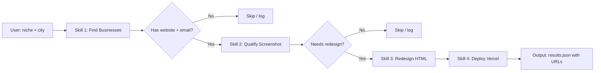

# COT: Build "Beautiful Websites Agent" Pipeline — Mục Tiêu & Lộ Trình Từng Bước

**Date:** 2026-03-22  
**Nguồn:** https://youtu.be/QiHXlY1EaB4 — Jay E | RoboNuggets  
**Framework:** Find ugly websites → auto-redesign → pitch clients

---

## 🧠 Chain of Thought

### Phân Tích Mục Tiêu Của Video

**Bài toán gốc:** Web design agencies tính $4K-$10K/site → local businesses không đủ tiền → website xấu tồn tại hàng chục năm.

**Giải pháp AI:** Build pipeline tự động:
1. Tìm businesses có website xấu (scale: hàng chục/ngày)
2. Tạo demo redesign trước → pitch sau (proof over promise)
3. Chi phí cực thấp (~$0.20/batch 50) → margin cực cao

**Mô hình kinh doanh:**
- Input: $0.20 AI cost + vài phút setup
- Output: 5-20 polished website demos
- Revenue per close: $500-$5,000 (tùy market)
- ROI: 1,000x-25,000x

**Tại sao phù hợp với workspace hiện tại:**
- Đã có OpenClaw + Claude API → chạy được ngay
- Đã có Vercel deployment workflow → skill deploy đã quen
- ClawNano2 (request interceptor) có thể extend cho scraping layer
- Research blog + AI influencer → có thể dùng pattern này cho content agencies

---

### Reasoning: Các Rủi Ro Cần Nhận Biết

1. **Apify cost scaling:** $0.20 cho 50 listings → nếu scrape 500/ngày = $2/ngày = $60/tháng. Acceptable.
2. **Unsplash photos:** Agent tự verify URL nhưng có thể dùng ảnh không phù hợp với brand client → cần manual review trước khi gửi.
3. **Legal grey area:** Scraping website content của người khác để redesign → chỉ dùng làm demo pitch, không publish thương mại.
4. **Client expectation:** Demo trông đẹp nhưng implementation thực tế cần dev work thêm → manage expectation.
5. **Apify API key needed:** Cần setup account Apify trước.

---

## 🎯 Mục Tiêu Cụ Thể

### Mission
> **"Tự động hóa toàn bộ pipeline từ tìm lead → redesign demo → ready-to-pitch, chạy hàng ngày cho một niche và thành phố cụ thể."**

### KPIs
- 20+ website demos/ngày khi pipeline stable
- Chi phí < $2/ngày (Apify)
- Conversion rate: target 10% demos → client conversation
- Revenue target: $1K-$5K per closed client

---

## 🗺️ Lộ Trình Từng Bước

---

### PHASE 0: Setup (1-2 ngày)

#### Bước 0.1 — Tạo tài khoản & API keys
```
[ ] Apify.com → tạo account → get API token
    Free tier: $5 credit miễn phí mỗi tháng → đủ để test
    Actor cần dùng: "Google Maps Email Extractor"
    
[ ] Vercel.com → get CLI + token
    (Đã có từ research-blog workflow → reuse)
    
[ ] Unsplash API key (free tier: 50 requests/hour)
    Đăng ký tại: unsplash.com/developers
```

#### Bước 0.2 — Cài Playwright (nếu chưa có)
```powershell
npm install -g playwright
playwright install chromium
```

#### Bước 0.3 — Tìm "taste skill" của Leon
```
Link trong video description → copy skill design system
Đây là base cho thiết kế đẹp
```

---

### PHASE 1: Build 4 Skills (2-3 ngày)

**Cách nhanh nhất:** Paste transcript video vào OpenClaw:
```
"Đọc transcript này và build 4 skills + workflow.mmd như mô tả trong video.
Lưu vào D:\_Tuan_AI\_2026\_code\TuanDoan_Workspace\skills\beautiful-websites\"
```

**Hoặc build từng skill thủ công:**

#### Skill 1: `find-businesses.md`
```
Viết SKILL.md hướng dẫn agent:
- Dùng Apify Google Maps Email Extractor
- Input: niche, city, số lượng listings
- Filter: chỉ giữ listing có website + email
- Drop junk emails tự động
- Output: CSV với columns: name, website, email, address
- Báo estimated cost trước khi chạy
```

#### Skill 2: `qualify-websites.md`
```
Viết SKILL.md hướng dẫn agent:
- Dùng Playwright chụp full-page screenshot
- Analyze screenshot với criteria:
  * Outdated visual design (pre-2015 aesthetic)
  * Table-based layouts
  * Basic/flat typography
  * Cluttered layout
  * Non-mobile-responsive
- Score 1-10, qualify nếu score ≤ 5
- Output: qualified list + reasons
```

#### Skill 3: `redesign-website.md`
```
Viết SKILL.md hướng dẫn agent:
- Scrape content từ website hiện tại
- Check build-log.json (tránh duplicate design combo)
- Search Unsplash với brand-relevant keywords
- Verify mọi photo URL trả về 200
- Generate single HTML file với design system
- Include: correct business name, address, Google Maps embed, real content
- Design system: modern, clean, mobile-first, hero + about + services + contact
```

#### Skill 4: `deploy-vercel.md`
```
Viết SKILL.md hướng dẫn agent:
- Dùng Vercel CLI: `vercel --prod --yes`
- Save deployed URL vào results.json
- Format: {businessName, oldSite, newSiteUrl, email}
```

#### File `workflow.mmd` (Mermaid diagram)


---

### PHASE 2: Test Run (1 ngày)

#### Bước 2.1 — Test với 5 listings trước
```
Prompt OpenClaw:
"Run beautiful websites pipeline for 5 nail salons in Sydney, step by step.
Show me the output after each step before proceeding."
```

**Checklist sau test:**
```
[ ] Apify scraping trả về data đúng format
[ ] Screenshots chụp được (không bị blocked)
[ ] Qualify logic reasonable (không quá strict/lax)
[ ] HTML output đẹp, mobile-friendly, real content
[ ] Vercel deploy thành công, URL accessible
[ ] build-log.json được update
```

#### Bước 2.2 — Review output trước khi pitch
```
[ ] Thay stock photos phù hợp hơn với brand
[ ] Check content accuracy (tên, địa chỉ, services)
[ ] Test URL trên mobile
[ ] Viết personalized email cho từng business
```

---

### PHASE 3: Scale & Automate (tuần 2)

#### Bước 3.1 — Setup cron job trong OpenClaw
```
Thêm vào heartbeat hoặc cron:
"Every weekday at 6am, run beautiful websites pipeline for
[niche] in [city], max 20 businesses. Save results to
outputs/YYYY-MM-DD-results.json"
```

#### Bước 3.2 — Build outreach automation (Step 5)
```
Skill 5: send-pitch-email.md
- Đọc results.json
- Viết personalized cold email với:
  * Business name
  * Specific problem đã identify ("I noticed your booking page...")
  * Link to demo site
  * Clear CTA (reply để discuss)
- Dùng Gmail API hoặc Instantly.ai để gửi
- Rate limit: max 20 emails/ngày để tránh spam filter
```

#### Bước 3.3 — Track trong Mission Control
```
Thêm vào dashboard:
- "Beautiful Websites" project screen
- Table: business name | old URL | new URL | email sent | response
- Stats: demos created / emails sent / responses / closes
```

---

### PHASE 4: Mở Rộng Niche (tuần 3+)

**Các bài toán tương tự có thể áp dụng cùng framework:**

| Niche | Vấn đề | AI Fix | Pitch |
|-------|--------|--------|-------|
| Website xấu | Visual outdated | Redesign HTML | Demo site |
| SEO kém | Low ranking | Auto SEO audit report | Audit + fix proposal |
| Google Business Profile thiếu | Incomplete listing | Auto-fill + optimize | Show before/after |
| Social media inactive | No posts | Generate content calendar | 30-day content plan |
| Menu PDF thay vì online | No online ordering | Convert to digital menu | Live demo menu |

---

## 📊 Execution Checklist

```
PHASE 0 — Setup
[ ] Apify account + API token
[ ] Verify Vercel CLI working (đã có)
[ ] Unsplash API key
[ ] Playwright installed

PHASE 1 — Build Skills
[ ] Tạo folder: skills/beautiful-websites/
[ ] Viết find-businesses.md (Apify)
[ ] Viết qualify-websites.md (Playwright)
[ ] Viết redesign-website.md (HTML + design system)
[ ] Viết deploy-vercel.md (Vercel CLI)
[ ] Viết workflow.mmd (Mermaid flow)
[ ] Copy/adapt "taste skill" từ Leon

PHASE 2 — Test
[ ] Run 5 businesses step-by-step
[ ] Manual review output quality
[ ] Fix/refine skills dựa trên kết quả

PHASE 3 — Scale
[ ] Setup cron: daily run 20 businesses
[ ] Build pitch email template
[ ] Add to Mission Control tracker

PHASE 4 — Outreach
[ ] Gmail API hoặc Instantly setup
[ ] Send first 10 manual pitches
[ ] Track responses, iterate on email copy
```

---

## 💡 Câu Lệnh Khởi Động Nhanh Nhất

```
Paste link video vào OpenClaw:
"Watch this video: https://youtu.be/QiHXlY1EaB4
Build the 'Beautiful Websites Agent Toolkit' described in this video.
Save all skills to: D:\_Tuan_AI\_2026\_code\TuanDoan_Workspace\skills\beautiful-websites\
Use my existing Vercel token from TOOLS.md.
Start with a test run of 5 businesses for [niche] in [city]."
```

---

*COT Output — Antigravity | 2026-03-22*
